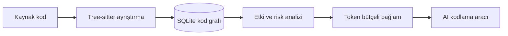
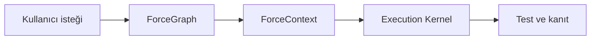

<div align="center">

# ForceGraph

### Local-first code intelligence for safer AI-assisted development

Build a persistent structural map of a repository, calculate the blast radius of
changes, and give coding agents only the context they actually need.

[](LICENSE)
[](https://www.python.org/)
[](https://modelcontextprotocol.io/)
[](#project-status)

[Türkçe](#türkçe) · [English](#english) · [Roadmap](docs/FORCEGRAPH_ROADMAP.md) · [Upstream project](https://github.com/tirth8205/code-review-graph)

</div>

---

## Türkçe

ForceGraph; kaynak kodunu fonksiyonlar, sınıflar, importlar, çağrılar ve testler
arasında gezilebilen bir grafa dönüştüren yerel bir kod zekâsı motorudur. Amaç,
AI kodlama araçlarının bütün projeyi tekrar tekrar okuması yerine yalnızca görevle
ilgili dosyaları ve ilişkileri görmesini sağlamaktır.

> [!IMPORTANT]
> ForceGraph, [`code-review-graph`](https://github.com/tirth8205/code-review-graph)
> projesinin MIT lisanslı geliştirme fork'udur. Mevcut sürüm upstream motorunu ve
> `code-review-graph` CLI adını uyumluluk için korur. ForceGraph'a özgü özellikler
> aşamalı olarak geliştirilmektedir.

### Neden ForceGraph?

- **Etki alanı analizi:** Bir değişikliğin etkileyebileceği çağıranları,
  bağımlılıkları, akışları ve testleri gösterir.
- **Token bütçeli bağlam:** AI'a bütün depo yerine küçük ve hedeflenmiş bir bağlam
  paketi sunar.
- **Yerel öncelikli:** Ana grafik SQLite içinde yerelde tutulur; temel çalışma
  için harici veritabanı gerekmez.
- **Artımlı indeksleme:** Yalnızca değişen dosyaları yeniden ayrıştırır.
- **MCP ve CLI:** Codex, Claude Code, Cursor ve MCP destekleyen diğer araçlara
  bağlanabilir.
- **Geniş dil desteği:** Python, JavaScript/TypeScript, Go, Rust, Java, C/C++, C#,
  PHP, PowerShell ve birçok başka dili Tree-sitter tabanlı olarak analiz eder.

### Çalışma mantığı



Bir dosya değiştiğinde ForceGraph bütün depoyu yeniden okutmak yerine grafı
izleyerek muhtemel etki alanını çıkarır:

```text
login()
├── auth_service.py
├── user_controller.py
├── session_manager.py
└── tests/test_login.py
```

### Hızlı başlangıç

Bir AI kodlama aracına yalnızca şunu söyleyebilirsiniz:

> Bu projeye ForceGraph'ı entegre et. [AI_INSTALL.md](AI_INSTALL.md) talimatlarını
> uygula, `quickstart-receipt.json` durumu `ready` olana kadar kurulumu doğrula.

Ya da proje klasöründe tek komut çalıştırın:

```bash
uvx --from "git+https://github.com/samansarmasik-alt/code-review-graph.git" forcegraph quickstart --platform codex --yes
```

`codex` yerine kullandığınız aracı yazabilirsiniz: `claude-code`, `cursor`,
`windsurf`, `gemini-cli`, `qoder`, `kiro`, `copilot` veya `codebuddy`.

Komut tek seferde:

1. MCP yapılandırmasını kurar.
2. Araca özgü talimat, skill ve hook'ları hazırlar.
3. Kaynak kod grafını oluşturur.
4. Sonucu `.code-review-graph/quickstart-receipt.json` dosyasında doğrular.
5. Yeniden başlatma gerekip gerekmediğini açıkça bildirir.

Kurulu paketle aynı işlem:

```bash
pip install code-review-graph
forcegraph quickstart --platform codex --yes
```

Kaynak koddan geliştirmek için:

```bash
git clone https://github.com/samansarmasik-alt/code-review-graph.git
cd code-review-graph
uv sync --group dev
uv run forcegraph quickstart --platform codex --yes
```

Yararlı komutlar:

```bash
code-review-graph status
code-review-graph update
code-review-graph watch
code-review-graph visualize
```

Belirli bir AI aracı için yalnızca onun MCP yapılandırmasını kurabilirsiniz:

```bash
code-review-graph install --platform codex
code-review-graph install --platform claude-code
code-review-graph install --platform cursor
code-review-graph install --platform codebuddy
```

İsteğe bağlı yetenek paketleri:

```bash
pip install "code-review-graph[embeddings]"
pip install "code-review-graph[google-embeddings]"
pip install "code-review-graph[communities]"
pip install "code-review-graph[enrichment]"
pip install "code-review-graph[eval]"
pip install "code-review-graph[wiki]"
pip install "code-review-graph[all]"
```

### ForceCode hedefi

ForceGraph bağımsız çalışmaya devam ederken ForceCode'un bağlam ve yürütme
motorlarıyla doğrudan haberleşecek şekilde geliştirilecektir:



Planlanan ilk entegrasyon komutları:

- `/graph` — proje mimarisini ve kritik düğümleri gösterir.
- `/impact` — seçilen değişikliğin etki alanını çıkarır.
- `/review` — diff, risk, test boşluğu ve gerekli bağlamı birleştirir.

Bu komutlar henüz kararlı sürüm özelliği değildir. Uygulama sırası ve kabul
kriterleri [ForceGraph yol haritasında](docs/FORCEGRAPH_ROADMAP.md) tutulur.

### Project status

ForceGraph aktif geliştirme aşamasındadır. Şu anda güvenilir upstream tabanı
korunmakta; yeni marka, entegrasyon sınırları ve geliştirme planı kurulmaktadır.
Üretim ortamında kullanmadan önce sürüm notlarını ve test sonuçlarını kontrol edin.

---

## English

ForceGraph is a local-first code intelligence engine that turns a repository into
a navigable graph of functions, classes, imports, calls, execution flows, and
tests. It helps AI coding tools understand change impact without repeatedly
reading an entire codebase.

### Core capabilities

- Persistent Tree-sitter-based structural graph
- Blast-radius and affected-flow analysis
- Incremental updates for changed files
- Token-aware review context through MCP and CLI
- Local SQLite storage with no required cloud database
- Interactive graph visualisation and export
- Broad language and framework coverage
- One-command, agent-readable onboarding with a verifiable installation receipt

ForceGraph is an active development fork of
[`tirth8205/code-review-graph`](https://github.com/tirth8205/code-review-graph).
The current release intentionally retains the upstream CLI and package identifiers
for compatibility while ForceGraph-specific integration layers are developed.

### One-command integration

Ask your coding agent to follow [AI_INSTALL.md](AI_INSTALL.md), or run:

```bash
uvx --from "git+https://github.com/samansarmasik-alt/code-review-graph.git" forcegraph quickstart --platform codex --yes
```

The command configures the selected AI platform, builds the graph, and writes a
machine-readable readiness receipt to
`.code-review-graph/quickstart-receipt.json`.

## Documentation

- [ForceGraph roadmap](docs/FORCEGRAPH_ROADMAP.md)
- [AI installation contract](AI_INSTALL.md)
- [Upstream README snapshot](docs/UPSTREAM_README.md)
- [Usage guide](docs/USAGE.md)
- [Command reference](docs/COMMANDS.md)
- [Architecture](docs/architecture.md)
- [Attribution and provenance](ATTRIBUTION.md)

## Contributing

Issues and pull requests are welcome. Please keep changes focused, include tests
for behavioural changes, and clearly distinguish upstream compatibility work from
ForceGraph-specific functionality. See [CONTRIBUTING.md](CONTRIBUTING.md).

## License

Licensed under the [MIT License](LICENSE). ForceGraph is derived from the
MIT-licensed `code-review-graph` project; original copyright and license notices
are preserved. See [ATTRIBUTION.md](ATTRIBUTION.md) for provenance details.
