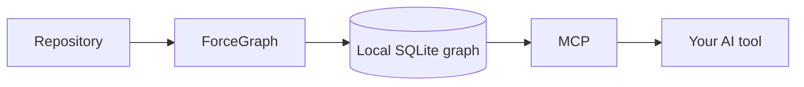

<div align="center">

# ForceGraph

### One local code graph. Every AI coding tool.

ForceGraph maps your repository once, then gives any MCP-capable coding agent
the smallest useful architecture, impact, test, and review context.

[](LICENSE)
[](https://www.python.org/)
[](https://modelcontextprotocol.io/)

[Türkçe](#türkçe) · [English](#english) · [Integrations](docs/INTEGRATIONS.md) · [Roadmap](docs/FORCEGRAPH_ROADMAP.md)

</div>

---

## Türkçe

ForceGraph herhangi bir AI kodlama aracının projeyi tekrar tekrar baştan
okumasını önleyen, yerel çalışan bir kod zekâsı katmanıdır. Fonksiyonları,
sınıfları, importları, çağrıları, testleri ve çalışma akışlarını SQLite tabanlı
bir grafa dönüştürür. Kaynak kodunuz yüklenmez.

### Tek komut, araç seçmek yok

Proje klasöründe çalıştırın:

```bash
uvx --from "git+https://github.com/samansarmasik-alt/code-review-graph.git" forcegraph connect
```

`connect` kurulu AI araçlarını otomatik algılar, mevcut MCP ayarlarını bozmadan
ForceGraph'ı ekler, kod grafını oluşturur ve sonucu doğrular. Codex, Claude Code,
Cursor, Windsurf, Zed, Continue, OpenCode, Gemini CLI, Qwen Code, Qoder, Kiro,
GitHub Copilot ve CodeBuddy desteklenir.

Bu işlem yalnızca bir kez yapılır. Sonrasında AI aracı ForceGraph MCP sunucusunu
otomatik başlatır; `--auto-watch` dosya değişikliklerini kendiliğinden indeksler.
Günlük kullanım için `build`, `update` veya `watch` komutu çalıştırmanız gerekmez.
Kurulum ayrıca dokuz yüksek değerli araca sahip kompakt MCP profilini etkinleştirir.
Böylece onlarca kullanılmayan araç şeması her agent turunda tekrar taşınmaz.
İhtiyaç hâlinde `forcegraph serve --tool-profile full` ile bütün araçlar açılabilir.

Tanımadığımız yeni bir MCP istemcisi için de
`.code-review-graph/mcp-config.json` dosyası üretilir. Bu dosyadaki
`mcpServers.code-review-graph` nesnesini istemcinin MCP ayarına kopyalamak
yeterlidir.

`uvx` yoksa:

```bash
python -m pip install "git+https://github.com/samansarmasik-alt/code-review-graph.git"
forcegraph connect
```

AI aracına yaptırmak isterseniz yalnızca şunu söyleyin:

> Bu repoya ForceGraph'ı bağla. AI_INSTALL.md dosyasını uygula ve receipt hazır
> olmadan işlemi tamamlandı sayma.

### Ne kazandırır?

- **Daha az token:** Agent, tüm repo yerine ilgili sembolleri ve ilişkileri alır.
- **Daha güvenli değişiklik:** Bir fonksiyonun çağıranları, testleri ve etki alanı
  değişiklikten önce görülebilir.
- **Tek grafik, çok araç:** Aynı yerel veri Codex, Claude Code, Cursor ve diğer
  MCP istemcileri tarafından kullanılabilir.
- **Artımlı güncelleme:** Yalnızca değişen dosyalar yeniden işlenir.
- **Gizlilik:** Temel özellikler internete kod göndermez ve harici veritabanı
  istemez.



### Günlük kullanım

Aşağıdaki komutlar yalnızca manuel inceleme ve hata ayıklama içindir; zorunlu
değildir:

```bash
forcegraph status
forcegraph update
forcegraph detect-changes --brief
forcegraph visualize
forcegraph watch
```

Belirli bir aracı zorlamak hâlâ mümkündür:

```bash
forcegraph connect --platform codex
forcegraph connect --platform claude-code
forcegraph connect --platform cursor
forcegraph install --platform codebuddy
```

İsteğe bağlı analiz paketleri:

```bash
pip install "code-review-graph[embeddings]"
pip install "code-review-graph[google-embeddings]"
pip install "code-review-graph[communities]"
pip install "code-review-graph[enrichment]"
pip install "code-review-graph[eval]"
pip install "code-review-graph[wiki]"
pip install "code-review-graph[all]"
```

Kurulum sonunda iki taşınabilir dosya oluşur:

- `.code-review-graph/quickstart-receipt.json` — doğrulanmış kurulum sonucu;
- `.code-review-graph/mcp-config.json` — genel MCP bağlantı tanımı.

---

## English

ForceGraph is a local-first code intelligence layer for any AI coding tool. It
indexes functions, classes, imports, calls, tests, and execution flows once, then
serves focused context through MCP instead of making every agent reread the
whole repository.

### One command, no tool selection

Run from a repository root:

```bash
uvx --from "git+https://github.com/samansarmasik-alt/code-review-graph.git" forcegraph connect
```

ForceGraph auto-detects installed clients, safely merges their MCP settings,
builds the graph, and writes a machine-readable receipt. It supports Codex,
Claude Code, Cursor, Windsurf, Zed, Continue, OpenCode, Gemini CLI, Qwen Code,
Qoder, Kiro, GitHub Copilot, and CodeBuddy.

Connected clients use the compact nine-tool MCP profile by default, reducing
tool-schema overhead while keeping the full surface available with
`forcegraph serve --tool-profile full`.

Unknown or future MCP clients can use the generated
`.code-review-graph/mcp-config.json` file. Copy its
`mcpServers.code-review-graph` entry into the client's MCP configuration.

### Documentation

- [Universal integrations](docs/INTEGRATIONS.md)
- [AI installation contract](AI_INSTALL.md)
- [Usage guide](docs/USAGE.md)
- [Commands](docs/COMMANDS.md)
- [Architecture](docs/architecture.md)
- [Troubleshooting](docs/TROUBLESHOOTING.md)
- [Attribution](ATTRIBUTION.md)

## Project status and provenance

ForceGraph is an independent, tool-neutral development fork of the MIT-licensed
[`tirth8205/code-review-graph`](https://github.com/tirth8205/code-review-graph).
The upstream package and CLI names remain available for compatibility. New work
is designed around open MCP contracts rather than a private dependency on any
Force-branded product. See [ATTRIBUTION.md](ATTRIBUTION.md).

## Contributing

Issues and pull requests are welcome. Include tests for behavioural changes and
preserve existing user configuration when changing installers. See
[CONTRIBUTING.md](CONTRIBUTING.md).

## License

[MIT](LICENSE)
