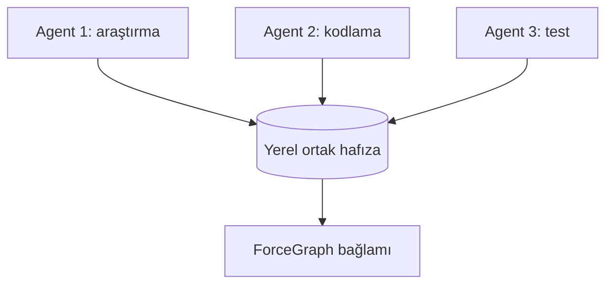

<div align="center">

# ForceGraph

### AI kodlama araçları için kur–unut kod bağlamı ve ortak agent hafızası

Projeyi bir kez haritalar; AI’ya bütün repoyu okutmak yerine yalnızca gerekli
kodu, ilişkileri, testleri ve diğer agent’ların kısa handoff notlarını verir.

[](LICENSE)
[](https://www.python.org/)
[](https://modelcontextprotocol.io/)

[Türkçe](#türkçe) · [English](#english) · [Kurulum](#30-saniyelik-kurulum) · [Dokümantasyon](docs/INDEX.md)

</div>

---

## Türkçe

### En kısa anlatım

ForceGraph beş işi otomatik yapar:

1. Projeyi yerel kod grafına dönüştürür.
2. Türkçe veya İngilizce soruyu anlayıp doğru graf sorgusunu seçer.
3. AI’ya yalnızca görevle ilgili küçük bağlamı verir.
4. Aynı projedeki agent’ların karar ve handoff notlarını paylaşır.
5. Dosyalar değiştikçe grafı güncel tutar.

Kaynak kod ve ortak hafıza yerelde kalır.

### 30 saniyelik kurulum

Proje klasöründe bir kez çalıştırın:

```bash
uvx --from "git+https://github.com/samansarmasik-alt/code-review-graph.git" forcegraph connect
```

Hepsi bu. Komut AI araçlarını algılar, MCP ayarını güvenle birleştirir, grafı
oluşturur, otomatik takibi açar ve sonucu
`.code-review-graph/quickstart-receipt.json` dosyasında doğrular.

Codex, Claude Code, Cursor, Windsurf, Zed, Continue, OpenCode, Gemini CLI,
Qwen Code, Qoder, Kiro, GitHub Copilot ve CodeBuddy desteklenir. Tanınmayan MCP
istemcileri için de hazır `.code-review-graph/mcp-config.json` üretilir.

AI agent’ına da yaptırabilirsiniz:

> Bu repoya ForceGraph’ı bağla:
> https://github.com/samansarmasik-alt/code-review-graph  
> AI_INSTALL.md dosyasını uygula. Receipt ready olmadan tamamlandı sayma.

### Siz sorarsınız, ForceGraph seçer

| Söylediğiniz | Arka planda yapılan |
| --- | --- |
| “Bu proje ne yapıyor?” | Küçük mimari özeti |
| “Login hatasını bul” | İlgili sembol ve ilişki araması |
| “Bu değişiklik nereyi bozar?” | Etki alanı ve bağımlılar |
| “Bu fonksiyonu kim kullanıyor?” | Çağıranlar ve ilgili testler |
| “Değişiklikleri incele” | Diff, risk ve test bağlamı |

MCP aracını veya graf komutunu sizin seçmeniz gerekmez.

### Neden yalnızca dört araç?

Çok sayıda MCP aracını her oturumda modele göstermek araç şeması bağlamını
büyütebilir. ForceGraph normal kullanımda yalnızca şunları gösterir:

| Araç | Ne yapar? |
| --- | --- |
| `forcegraph_context_tool` | Soruyu anlayıp doğru küçük bağlamı getirir |
| `forcegraph_memory_tool` | Agent kararlarını ve handoff’ları paylaşır |
| `detect_changes_tool` | Derin değişiklik/risk incelemesi yapar |
| `build_or_update_graph_tool` | Eksik veya eski grafı onarır |

Gelişmiş araçlar kaldırılmadı:
`forcegraph serve --tool-profile full`.

### Çoklu terminal hafızası nasıl çalışır?

Aynı repo ve branch üzerinde çalışan agent’lar otomatik olarak aynı görev
hafızasını kullanır. `task_id` veya `agent_id` yazmanız gerekmez.



Bütün konuşmalar saklanmaz. Yalnızca kısa karar, bulgu, not ve handoff kayıtları
paylaşılır. Normal bağlam çağrısı ilgili son kayıtları otomatik görür.

Görev kimliği sırası:

1. Açıkça verilen `task_id`
2. `FORCEGRAPH_TASK_ID`
3. Mevcut git branch’i
4. Git yoksa çalışma alanı

Agent kimliği de desteklenen session ortam değişkenlerinden otomatik çözülür.
Kayıtlar varsayılan 72 saatte sona erer, okuma boyutu sınırlıdır ve yaygın
API anahtarı/parola/token biçimleri yazılmadan maskelenir.

> Farklı makinelerde veya ortak klasörü olmayan izole konteynerlerde yerel hafıza
> otomatik paylaşılmaz.

### Neden upstream yerine ForceGraph?

ForceGraph, MIT lisanslı
[`tirth8205/code-review-graph`](https://github.com/tirth8205/code-review-graph)
motorunu kullanır. Graf motorunu yeniden icat ettiğimizi iddia etmiyoruz.
Farkımız, motoru agent uygulamalarında zahmetsiz bir bağlam geçidine çevirmektir.

| İhtiyaç | Upstream | ForceGraph |
| --- | --- | --- |
| Uzman graf araçlarını elle yönetmek | Daha uygun | Tam profilde mümkün |
| Tek komut bağlantı | Seçenekler mevcut | Otomatik algılama + receipt |
| Türkçe doğal görev | Minimal başlangıç | Türkçe/İngilizce router |
| Küçük MCP yüzeyi | Filtrelenebilir | Varsayılan dört araç |
| Çoklu terminal hafızası | Temel özellik değil | Yerleşik ve branch tabanlı |
| Bilinmeyen istemci | Manuel MCP | Hazır taşınabilir manifest |
| Güncellik | Hook/watch seçenekleri | Bağlantıda otomatik watch |

Kısaca: grafı elle ve ayrıntılı kontrol etmek için upstream; “repoya bağlan ve
doğru bağlamı kendin seç” deneyimi için ForceGraph.

### Token konusunda dürüst açıklama

Upstream motor benchmark’ı bütün corpus karşılaştırmasında soru başına medyan
yaklaşık **82×** daha küçük graf bağlamı bildirir
([metodoloji](docs/REPRODUCING.md)). Bu toplam sohbet maliyeti değildir.

ForceGraph ayrıca araç yüzeyini dörde indirir ve ortak hafızayı sınırlar. Ancak
bu ek kazanç için henüz bağımsız v2.6 model benchmark’ı yayımlamadık; ölçmeden
kesin yüzde söylemiyoruz.

Azalabilenler:

- tekrar okunan repo dosyaları,
- gereksiz MCP araç şemaları,
- agent’ların tekrarladığı araştırmalar.

Sistem mesajı, konuşma geçmişi, model düşünmesi ve cevap tokenleri devam eder.
Küçük tek dosyalı işlerde kazanç az olabilir.

### Kimler kullanmalı?

**Uygun:** orta/büyük repo, birden fazla agent, Türkçe görevler, MCP ayrıntılarıyla
uğraşmak istemeyen ekipler ve yerel veri isteyen projeler.

**Şimdilik uygun değil:** birkaç dosyalı script, MCP/terminal desteklemeyen agent
ve farklı makineler arasında bulut hafızası gereken ekipler.

<details>
<summary><strong>Manuel komutlar ve yerel dosyalar</strong></summary>

Günlük kullanımda gerekmez:

```bash
forcegraph status
forcegraph update
forcegraph detect-changes --brief
forcegraph visualize
forcegraph serve --tool-profile full
```

`uvx` yoksa:

```bash
python -m pip install "git+https://github.com/samansarmasik-alt/code-review-graph.git"
forcegraph connect
```

Yerel durum:

- `.code-review-graph/graph.db`
- `.code-review-graph/agent-memory.db`
- `.code-review-graph/mcp-config.json`
- `.code-review-graph/quickstart-receipt.json`

</details>

### Dokümantasyon

[AI kurulumu](AI_INSTALL.md) · [Entegrasyonlar](docs/INTEGRATIONS.md) ·
[Kullanım](docs/USAGE.md) · [Komutlar](docs/COMMANDS.md) ·
[Mimari](docs/architecture.md) · [Yol haritası](docs/FORCEGRAPH_ROADMAP.md) ·
[Atıf](ATTRIBUTION.md)

---

## English

ForceGraph is a local-first context gateway built on the MIT-licensed
`tirth8205/code-review-graph` engine. It adds one-command client detection,
auto-watch, a four-tool compact MCP surface, Turkish/English task routing,
installation receipts, and bounded shared memory for parallel terminal agents.

```bash
uvx --from "git+https://github.com/samansarmasik-alt/code-review-graph.git" forcegraph connect
```

After installation, ask normal coding questions. Agent and task identities are
resolved automatically from session environment and git branch. Use
`--tool-profile full` only for the expert surface.

See [integrations](docs/INTEGRATIONS.md), [usage](docs/USAGE.md),
[AI install contract](AI_INSTALL.md), and [attribution](ATTRIBUTION.md).

## License

[MIT](LICENSE)
